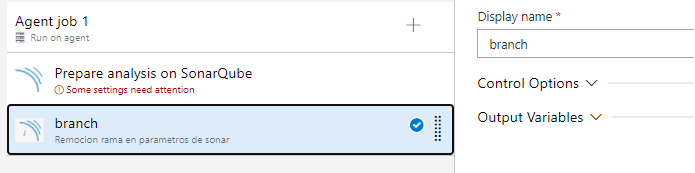
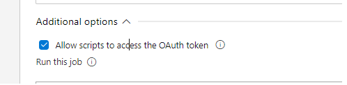
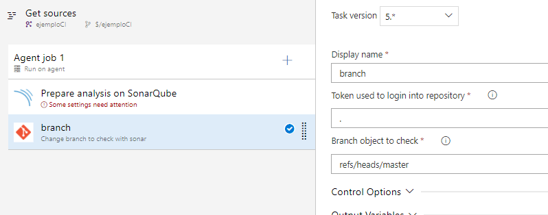

## Change branch to check with sonar

Hi buddy, :+1:

If you are here, maybe is because you have problems using sonar task or you're lost :flushed:, it was kidding.

After putting sonar task, you require setting this custom task to change the parameter "sonar.branch.name" because this is automatically set by the sonar task. 

This feature was introduced in sonar version 7.6, for not allow to check other branches different from the main branch.

To use this extension is so easy

Take in mind that here there are two versions for the same task: the first one works only in SO Windows because it was developed in PowerShell, the second one work in Linux, Windows or Mac, this was developed in Node. Remember this topic, you need to set these capabilities in the agents that you want to use.

Versions:
* Sonar branch 2 - Change sonar parameters
* Sonar branch - Change sonar parameters

### Change default branch

This is another option to correct the problem in work with another branch different from the main branch. This choice changes the main branch into the repository, currently, this extension only works with Azure DevOps repos.

Similar to the previous custom task, there are two versions to the same goal. the first one work in SO Windows (version Powershell) and the second one work with SO Linux, Windows or Mac (version node). Take in mind this topic to provide the agents with the required capabilities

To work with this task you need :
Enable option into the agent job for allowing access to the script to token information

You need to set the branch to be the default branch

Versions:
* Branch - Change branch to check with sonar
* Branch2 - Change branch to check with sonar

